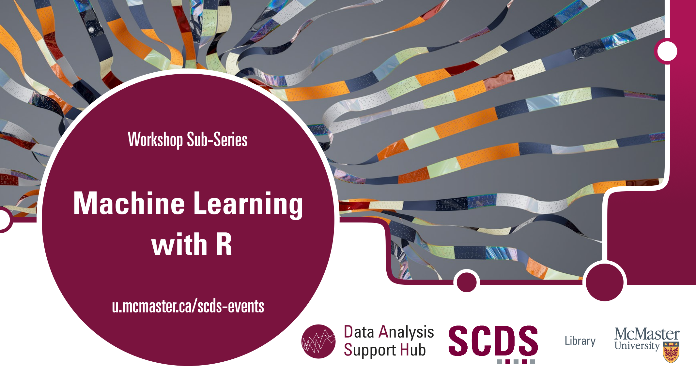



<!-- Main header -->
# Welcome to Machine Learning with R

Machine Learning with R is a special sub-series supported by the Data Analysis Support Hub (DASH).

These workshops will introduce participants to the theory of several machine learning techniques and algorithms, and provide opportunities to apply them to real data.

## Machine Learning with R Workshop Topics

  Workshops

<ul>


<li><a href="{{workshop.url | absolute_url}}">{{workshop.title}}</a></li>


</ul>

## Land Acknowledgment

