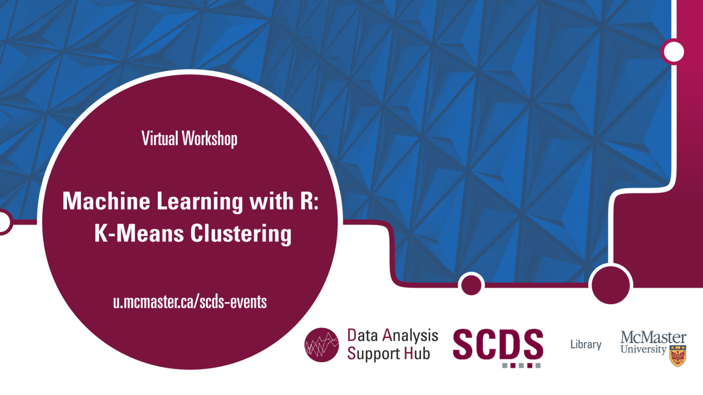

# Machine Learning with R: K-Means Clustering

Clustering is an unsupervised machine learning approach for finding subgroups of observations within a data set. This workshop will introduce participants to the theoretical part of the most common clustering method, k-means clustering. Afterwards, participants will gain hands-on experience in how to conduct K-means clustering in R, as well as how to interpret and visualize their results.

## Workshop Offerings

March 2024

**Facilitator Bio**  
Amirreza is a Master’s student in the Electrical and Computer Engineering department of McMaster University with 8 years of experience in different programming languages.  

<iframe height="416" width="100%" allowfullscreen frameborder=0 src="https://echo360.ca/media/05d3b122-5db5-4fe0-957b-2a00a676cc30/public"></iframe>

[View original here.](https://echo360.ca/media/05d3b122-5db5-4fe0-957b-2a00a676cc30/public)

<embed src="assets/docs/KMeansSlidesJan2024.pdf" style="border:none;" width="100%" height="466px">
[Download as PDF.](assets/docs/KMeansSlidesJan2024.pdf)

October 2022

**Facilitator Bio**  
Presentation by Shaila Jamal, DASH Support Assistant and PhD Candidate in Earth, Environment, and Society.

This event was run in collaboration with the [YWCA’s Uplift Program](https://www.ywcahamilton.org/skills-development-and-training/uplift/), which supports women and non-binary people re-skilling to enter the tech industry.

<iframe height="416" width="100%" allowfullscreen frameborder=0 src="https://echo360.ca/media/e878d90e-d572-4533-ab6c-2ce8b47ee65b/public"></iframe>
[View the original here.](https://echo360.ca/media/e878d90e-d572-4533-ab6c-2ce8b47ee65b/public) 

<embed src="assets/docs/KMeansSlidesOct2022.pdf" style="border:none;" width="100%" height="466px">
[Download as PDF.](assets/docs/KMeansSlidesOct2022.pdf)

