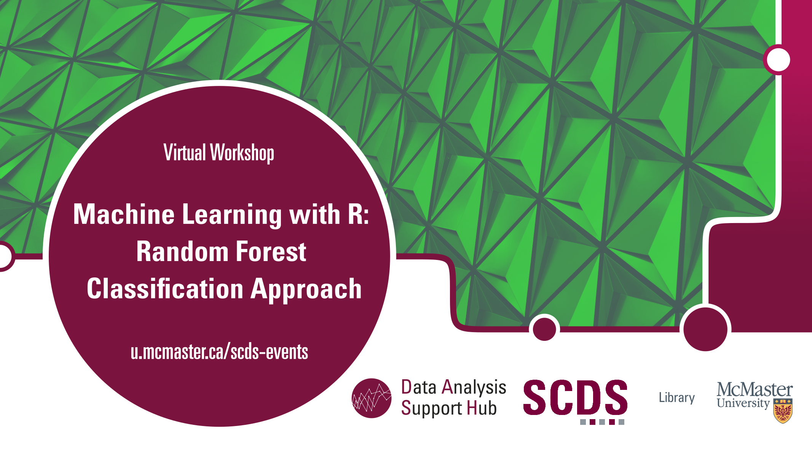

# Machine Learning with R: Random Forest Classification Approach

Random Forest is an ensemble machine learning technique used for both classification and regression tasks. It is based on the concept of decision trees, where multiple decision trees are trained on different subsets of the data, and their predictions are combined to produce a more accurate and robust final prediction. This workshop will go over the theory of Random Forests and then provide attendees with hands-on training on conducting Random Forest classification, training the data, testing accuracy, and working with tuning parameters. 

## Workshop Offerings

March 2024

**Facilitator Bio**  
Amirreza is a Master’s student in the Electrical and Computer Engineering department of McMaster University with 8 years of experience in different programming languages. 

<iframe height="416" width="100%" allowfullscreen frameborder=0 src="https://echo360.ca/media/7b643684-a49d-4229-a7ac-ed1d45d309a3/public"></iframe>
[View original here.](https://echo360.ca/media/7b643684-a49d-4229-a7ac-ed1d45d309a3/public)

<embed src="assets/docs/RandomForestSlidesMar2024.pdf" style="border:none;" width="100%" height="466px">
[Download as PDF.](assets/docs/RandomForestSlidesMar2024.pdf)

January 2023

**Facilitator Bio**  
Presentation by Shaila Jamal, DASH Support Assistant and PhD Candidate in Earth, Environment, and Society.

This event was run in collaboration with the [YWCA’s Uplift Program](https://www.ywcahamilton.org/skills-development-and-training/uplift/), which supports women and non-binary people re-skilling to enter the tech industry.

<iframe height="416" width="100%" allowfullscreen frameborder=0 src="https://echo360.ca/media/dcab4112-0199-47ce-a4cf-5453c2a82ec5/public"></iframe>
[View the original here.](https://echo360.ca/media/dcab4112-0199-47ce-a4cf-5453c2a82ec5/public)

<embed src="assets/docs/RandomForestSlidesJan2023.pdf" style="border:none;" width="100%" height="466px">
[Download as PDF.](assets/docs/RandomForestSlidesJan2023.pdf)

